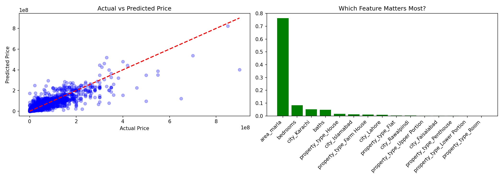

# 🏠 Pakistan House Price Prediction

A Machine Learning model that predicts property prices in Pakistan using real data from Zameen.com.

## 📊 Results
- **R2 Score:** 0.79 (79% accuracy)
- **Model Used:** Random Forest Regressor
- **Dataset:** 92,767 properties from Zameen.com

## 🔍 Key Findings
- **Area (Marla)** is the most important factor in price prediction (76%)
- **Bedrooms** is the second most important factor (9%)
- Cities covered: Islamabad, Lahore, Karachi, Rawalpindi, Faisalabad

## 🛠️ Technologies Used
- Python
- Pandas & NumPy
- Scikit-learn
- Matplotlib
- Google Colab

## 📁 Dataset
Dataset sourced from Zameen.com containing properties across major Pakistani cities.
Features include: location, area, bedrooms, bathrooms, property type, city.

## 📈 Visualizations

## 🚀 How to Run
1. Open `house_price_prediction.ipynb` in Google Colab
2. Upload the dataset
3. Run all cells in order
